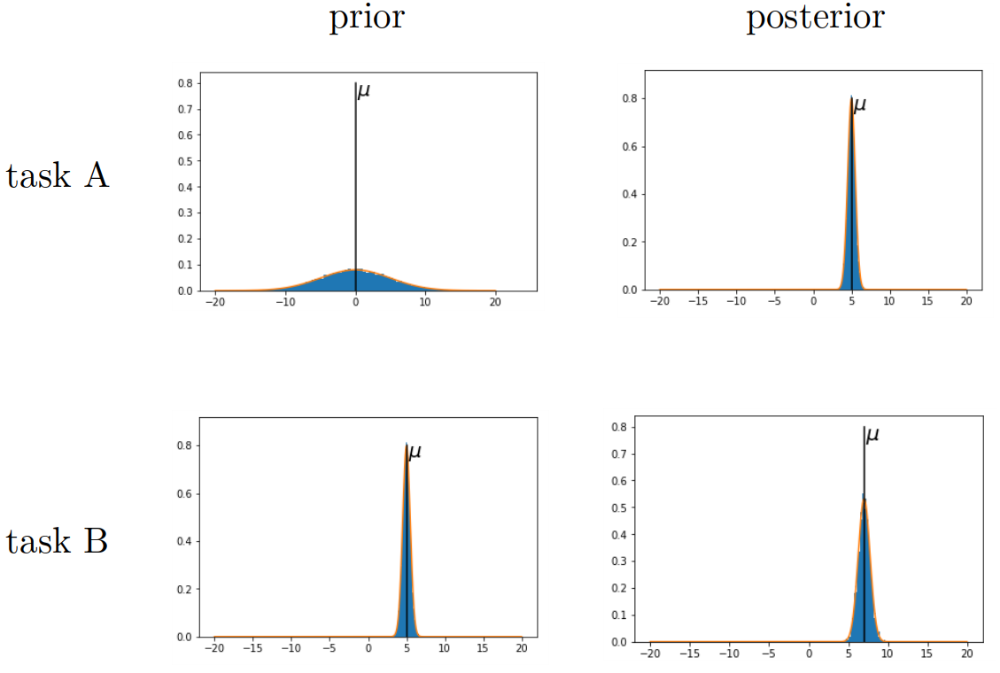
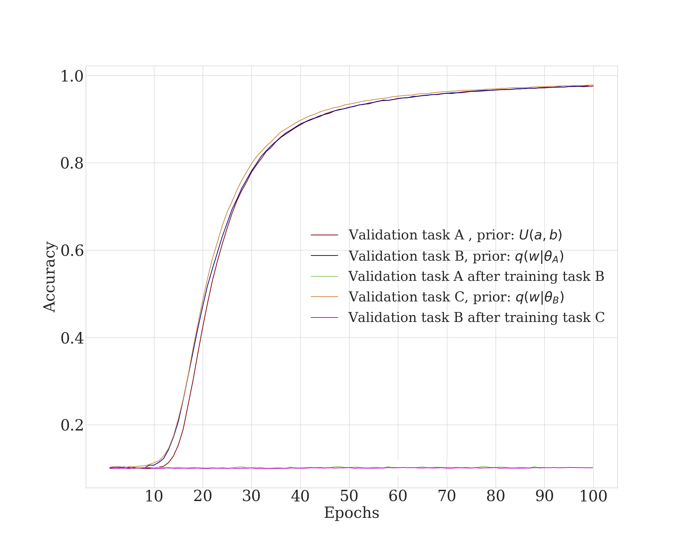
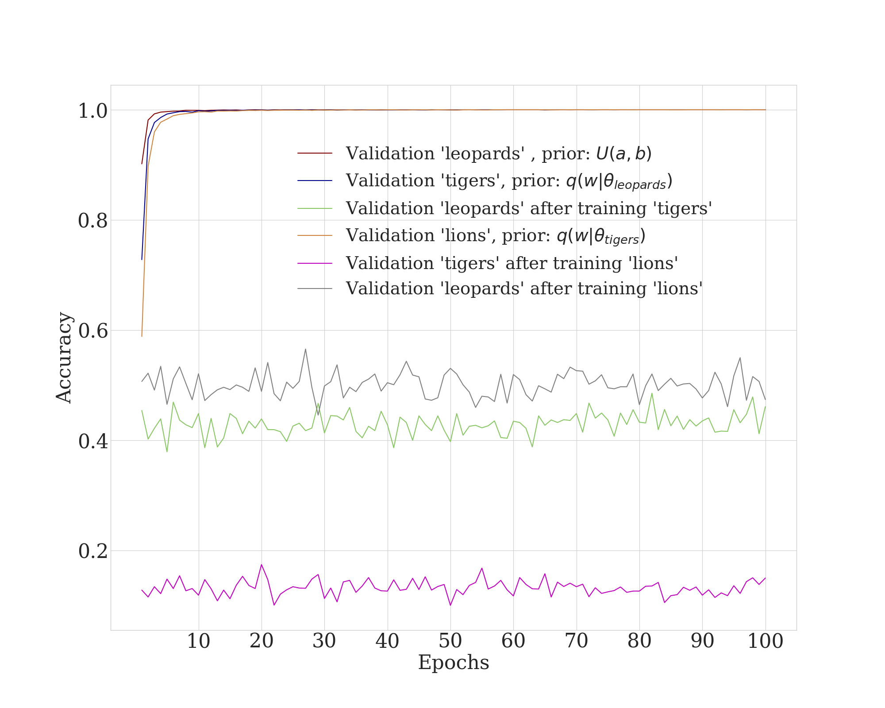
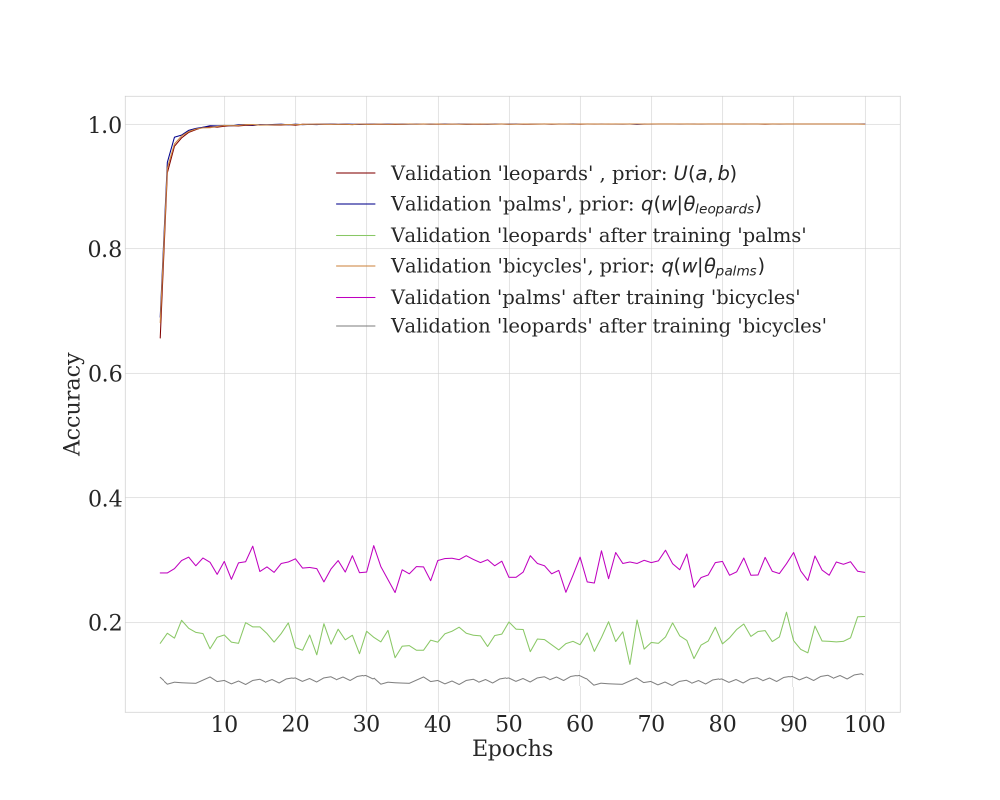

# Continual learning with a Bayesian CNN

## Instructions
`main_continual.py` is the main file. Run it each time with the subsequent hyperparameters configurations:

1. `pretrained = False` will give you `weights_1.pkl` (everything else as it is by default)
2. `pretrained = True`, and `task = 2` will give you `weights_2.pkl` to evaluate forward transfer
3. `is_training = False`, `pretrained = True`, `task = 2` to evaluate backward transfer, i.e. ability to overcome catastrophic forgetting
4. `pretrained = True`, `task = 3`  will give you `weights_3.pkl`
5. `is_training = False`, `pretrained = True`, `task = 3`
6. (and so on for as many tasks as you want)

### how we transfer parameters

### Results

#### Results on permutations on MNIST

#### Results on *similar* CIFAR-100 classes ("leopards", "tigers", "lions")

#### Results on *dissimilar* CIFAR-100 classes ("leopards", "palms", "bicycles")

[Bayesian CNN repository](https://github.com/felix-laumann/Bayesian_CNN)
